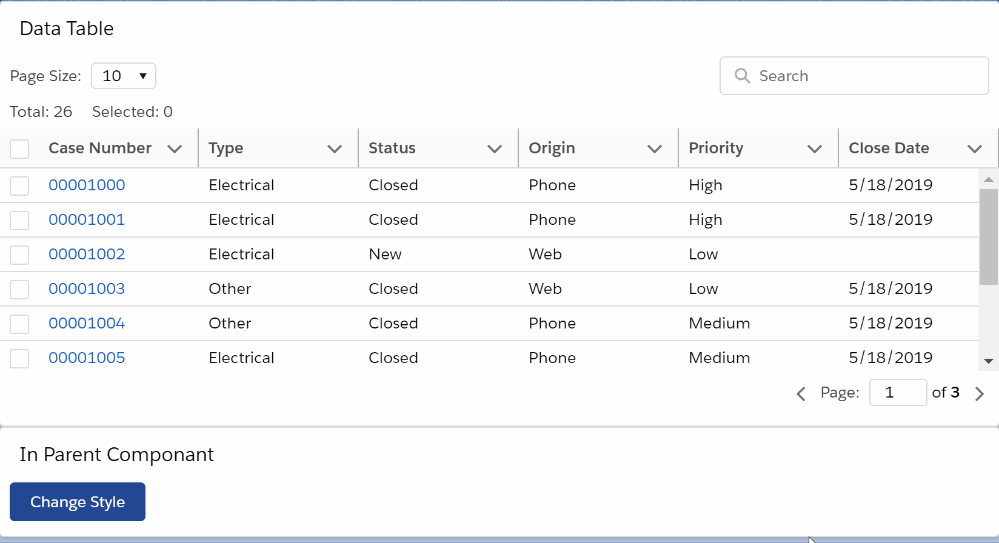

# Datatable using LWC

## Introduction

Lightning web components \(LWC\) are custom HTML elements built using HTML , modern JavaScript and LWC uses core [Web Components](https://github.com/w3c/webcomponents/) standards and provides only what’s necessary to perform well in browsers supported by Salesforce. Because it’s built on code that runs natively in browsers, Lightning Web Components is lightweight and delivers exceptional performance. Most of the code you write is standard JavaScript and HTML.

### Datatable in LWC

OOB _lighting-datatable_ component displays tabular data where each column can be displayed based on the data type. It has lot of great features inbuilt, but if we have data with more than 100 rows that needs to render on page, we should either Implement **Pagination** or **Infinite scroll** for better user experience.

In this article we will focus on creating _generic data table component_ with key features like \(_Pagination, Row selection, Static Headers and Global Search_ \). Source code for this article is in [lwcDatatable](https://github.com/chilsai/lwcDatatable) repo.

### Create Generic Component

First we will create _generic data table component_ and we call the Component as _**lwcDatatableUtility.**_

1. Create a lightning web components  with _Component_ Name as "_**lwcDatatableUtility**_".
2. Replace code in **lwcDatatableUtility.js, lwcDatatableUtility.html, lwcDatatableUtility.css** from [lwcDatatableUtility](https://github.com/chilsai/lwcDatatable/tree/master/force-app/main/default/lwc/lwcDatatableUtility). 
3. Deploy the **lwcDatatableUtility** component to your Org. 
4. Now we have generic Data table component ready to use and we can plug this to your own components.

### Plug-In Generic Component\(_**lwcDataTableUtility**_ \) to your Component

To use generic _**lwcDataTableUtility**_ component in your own component.

1. Declare below variables in **lwcDatatableUtility.js** which we will be using to send Data to [lwcDatatableUtility](https://github.com/chilsai/lwcDatatable/tree/master/force-app/main/default/lwc/lwcDatatableUtility) to render Table
   * allRecords
   * columns
2. To Render Table we need to include **lwcDatatableUtility** in .html page as below.

You can reference [**updateMultipleCases**](https://github.com/chilsai/lwcDatatable/tree/master/force-app/main/default/lwc/updateMultipleCases) component on how to use _lwcDataTableUtility**.**_

```markup
<c-lwc-datatable-utility records={allRecords} 
total-records={allRecords.length} 
columns = {columns}
key-field="Id"
show-search-box="true"            
max-row-selection={allRecords.length}
onpaginatorchange={handlePaginatorChange}
onsetselectedrecords={handleAllSelectedRows}>
</c-lwc-datatable-utility>
```



